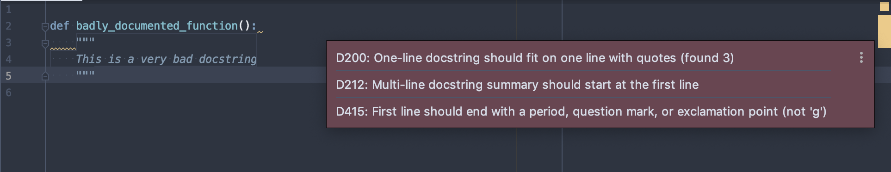
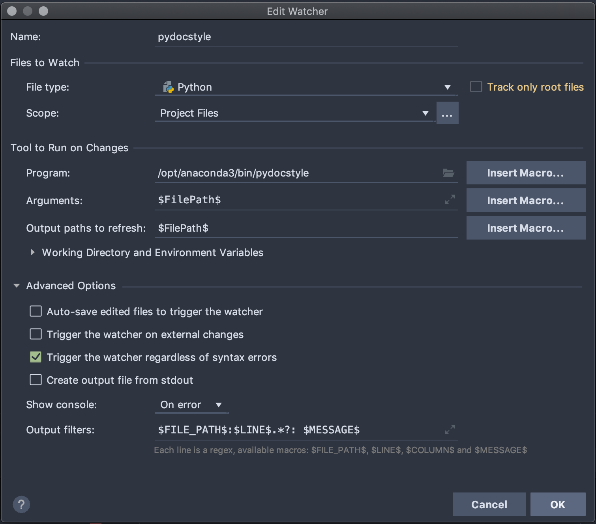

# pydocstyle-pycharm-integration

This is a fork of [pydocstyle](https://github.com/PyCQA/pydocstyle) to experiment with improved [PyCharm](https://www.jetbrains.com/pycharm/) integration possibilities and is merely meant to act as a proof of concept.

With this minimally amended version of [pydocstyle](https://github.com/PyCQA/pydocstyle) and the right PyCharm configurations, it is possible to directly see error stripe marks and corresponding error messages in the editor, as shown below:



## Setup

1. Clone this repository and install the package:

```bash
$ git clone https://github.com/OliverSieweke/pydocstyle.git
$ cd pycodestyle
$ python setup.py
```

​		Make reference of the location where the pydocstyle binary was installed (watch for the line `Installing pydocstyle script to ...` )

2. Configure PyCharm (<u>NB</u>: this has been tested with *PyCharm Professional 2019.3*)

   - Open a Python project
   - Go to `PyCharm > Preferences... > Tools > File Watchers`
   - Add a file watcher by clicking the  icon, select `<custom>` and provide the following configurations:
     - Name: `pydocstyle`
     - File Types: `Python`
     - Scope: `Project Files`
     - Program: `<path to the pydocstyle binary from step 1>`
     - Arguments: `$FilePath$`
     - Output paths to refresh: `$FilePath$`
     - Working directory: `$ProjectFileDir$` 
     - Auto-save edited files to trigger the watcher: ✘
     - Trigger the watcher on external changes: ✘
     - Trigger the watcher regardless of syntax errors: ✔︎
     - Create output file from stdout: ✘
     - Show console: `Never`
     - Output filters: `$FILE_PATH$:$LINE$.*?: $MESSAGE$`

    <p align="center">
        
    </p>
      
   - Go to `PyCharm > Preferences... > Editor > Inspections > File Watchers` and make sure the `File watcher problems` inspection is enabled.

3. Write some Python code with docstrings not conforming to the [PEP 257](https://www.python.org/dev/peps/pep-0257/) conventions and save your file.

4. You should now see error stripe marks appear on the right hand side of your editor window with corresponding error message tooltips when hovering over them! 🎉


I hope this was interesting, comments are very welcome….

## Resources

- [Original pydocstyle package](https://pypi.org/project/pydocstyle/)
- [PEP 257 -- Docstring Conventions](https://www.python.org/dev/peps/pep-0257/)
- [PyCharm File Watcher Documentation](https://www.jetbrains.com/help/pycharm/settings-tools-file-watchers.html)
